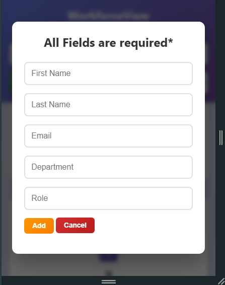

# WorkforceView - Employee Directory 
Deployed✅- https://workforceview.netlify.app/

A responsive employee directory web application built with vanilla HTML, CSS, and JavaScript, featuring comprehensive employee management capabilities with modern UI design.

## 🚀 Setup and Run Instructions

### Prerequisites

- Modern web browser (Chrome, Firefox, Safari, Edge)
- No additional software or server setup required


### Installation \& Running

1. **Clone the repository:**

```bash
git clone https://github.com/your-username/hussain-sharif-workforceview.git
cd hussain-sharif-workforceview
```

2. **Open the application:**
    - Simply open `index.html` in your web browser


3. **Access the application:**
    - Direct file: Open `index.html` in browser
   

## 📁 Project Structure

```
hussain-sharif-workforceview/
├── README.md                          # Project documentation
├── index.html                         # Main application entry point
├── Resources/
│   └── templates/
│       └── dashboard.ftlh            # Freemarker template reference
└── Static/
    ├── css/
    │   └── styles.css                # Application styling
    └── js/
        ├── data.js                   # Mock employee data & constants
        ├── employeeManager.js        # Employee data management logic
        ├── uiController.js          # UI rendering and DOM manipulation
        └── main.js                  # Main application logic & event handlers
```


### Architecture Overview

- **Modular Design:** Separation of concerns with dedicated modules for data management, UI control, and application logic
- **Template Structure:** Includes Freemarker template for understanding server-side rendering concepts
- **Static Implementation:** Fully functional without backend dependencies
- **Responsive Layout:** Mobile-first design with comprehensive breakpoints


## ✨ Features

### Core Functionality

- **Employee Management:** Add, edit, and delete employee records
- **Advanced Search:** Real-time search by name or email
- **Multi-field Filtering:** Filter by first name, department, and role
- **Dynamic Sorting:** Sort employees by name or department
- **Pagination System:** Configurable items per page (5, 10, 20, 50)


### User Experience

- **Responsive Design:** Optimized for desktop, tablet, and mobile devices
- **Modern UI:** Clean, professional interface with gradient backgrounds
- **Interactive Elements:** Hover effects, smooth transitions, and visual feedback
- **Form Validation:** Client-side validation with error messaging
- **Accessibility:** Keyboard navigation and screen reader friendly


### Technical Implementation

- **Vanilla JavaScript:** No external frameworks or dependencies
- **CSS Grid \& Flexbox:** Modern layout techniques for responsive design
- **Local Storage Ready:** Architecture supports data persistence
- **Template Pattern:** Demonstrates understanding of template-driven development


## 📸 Screenshots

<!-- Add screenshot here: Desktop view of the employee directory -->
*Desktop View - Employee Directory Dashboard*


<!-- Add screenshot here: Mobile responsive view -->
*Mobile View - Responsive Design*


<!-- Add screenshot here: Add/Edit employee form modal -->
*Employee Form - Add/Edit Functionality*




## 🔧 Technical Decisions

### Freemarker Template Approach

- Included `dashboard.ftlh` to demonstrate understanding of template engines
- Simulated server-side rendering using JavaScript for local development
- Maintained template structure while ensuring browser compatibility


### Code Organization

- **IIFE Pattern:** Used Immediately Invoked Function Expressions for module encapsulation
- **Single Responsibility:** Each module handles specific functionality
- **Event-Driven Architecture:** Clean separation between data operations and UI updates


## 🎯 Reflection

### Challenges Faced

**Framework Transition:** Having an React development habit, adapting to vanilla JavaScript required reacquainting myself with fundamental concepts like IIFEs, closures, and manual DOM manipulation. The initial phase felt overwhelming without the familiar component-based architecture and state management patterns.

**Freemarker Integration:** Understanding Freemarker templates presented a significant learning curve. Initially, I was concerned about the Java server requirement, but through careful analysis of the assignment requirements, I discovered the flexibility to simulate template functionality using JavaScript while maintaining the conceptual understanding of server-side rendering.

**Vanilla JavaScript Complexity:** Implementing features that are straightforward in React—such as state management, event handling, and component updates—required more deliberate planning and manual implementation in vanilla JavaScript. This challenged me to think more fundamentally about web development principles.

**CSS Development:** Transitioning from Tailwind CSS utility classes back to writing custom CSS required additional time and effort. Creating responsive layouts and maintaining consistent styling across components demanded more detailed attention to CSS architecture.


## 🛠 Technologies Used

- **HTML5:** Semantic markup and modern web standards
- **CSS3:** Grid, Flexbox, custom properties, and responsive design
- **Vanilla JavaScript:** ES6+ features, modules, and modern DOM APIs
- **Freemarker:** Template engine concepts and structure understanding


## 📝 License

This project is developed as part of a technical assignment for AJACKUS Company.

**Developer:** Hussain Sharif
**Project:** Employee Directory Management System
**Framework:** Vanilla Web Technologies
